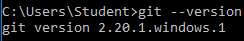
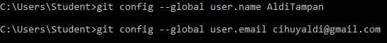
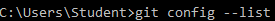
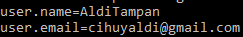
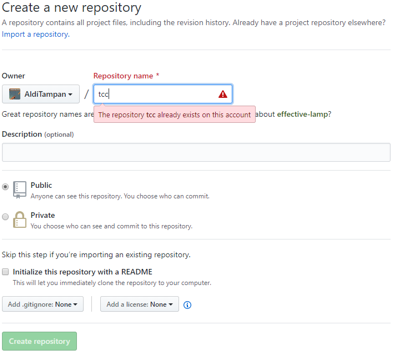
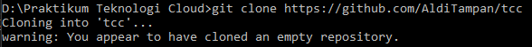
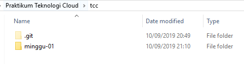
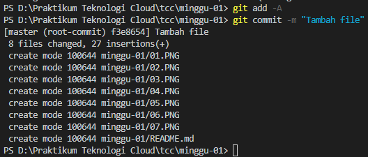
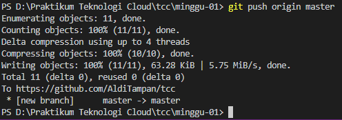

## Praktikum Praktikum Teknologi Cloud

### Pertemuan 1

##### Laurentius Rezaldi Pradana Putra / 175410043     

1. Cek terlebih dahulu apakah git sudah terinstal atau belum didalam cmd


2. Lakukan konfigurasi akun git anda terlebih dahulu dengan cara memasukkan Username dan Email anda


   Setelah itu pastikan bahwa akun git anda sudah terkoneksi dengan komputer lokal



3. Buat repositori baru dengan nama "tcc"

   Lakukan cloning repositori yang sudah anda buat ke komputer lokal
   
   Buat folder untuk mengisi repositori

   ```
   md minggu-01
   ```
   
   Lakukan git add dan git commit
   
   Kemudian lakukan push
   


