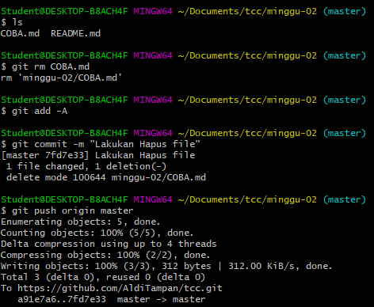
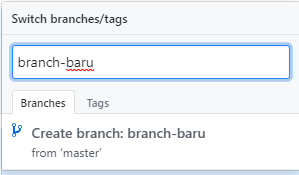
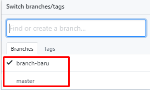
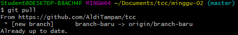

## Praktikum Teknologi Cloud

### Pertemuan 2

##### Laurentius Rezaldi Pradana Putra / 175410043 

1. Disini kita mencoba menghapus file yang baru saja kita buat didalam repository

2. Membuat branch baru
    
    

    dapat dilihat bahwa disini sudah terdapat 2 branch

    

3. Lakukan git pull untuk melihat branch yang baru saja kita buat

    

4. Dengan git checkout kita bisa mengganti branch yang lama dengan branch yang baru

    
