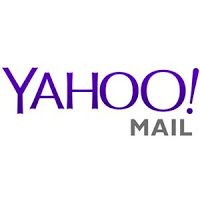
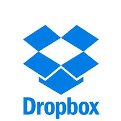

## Praktikum Teknologi Cloud

### Pertemuan 3

##### Laurentius Rezaldi Pradana Putra / 175410043 

## SaaS
SaaS adalah suatu model penyampaian aplikasi perangkat lunak oleh suatu vendor perangkat lunak yang mengembangkan aplikasi web yang diinangi dan dioperasikan untuk digunakan oleh pelanggannya melalui Internet. Pelanggan tidak mengeluarkan uang untuk memiliki perangkat lunak tersebut melainkan hanya untuk menggunakan.

## Keuntungan:

Pengguna dapat langsung memanfaatkan layanan secara gratis atau dengan bayar biaya sewa tanpa harus mengeluarkan investasi untuk membuat sendiri (in-house development) atau membeli lisensi yang relatif mahal.

Ketersediaan dan reliabilitas aplikasi terjamin oleh penyedia layanan. Pengguna hanya perlu fokus pada data miliknya. Perangkat yang dibutuhkan oleh pengguna juga hanya komputer dan internet.

## Kerugian:

Pengguna tidak memiliki kendali penuh atas aplikasi yang disewa. Pengguna tidak dapat dengan seenaknya mengubah fitur-fitur yang disediakan karena SaaS bersifat multi-tenant sehingga fitur-fitur yang dibuat adalah fitur yang umum (tidak bisa spesifik terhadap kebutuhan pengguna tertentu). Pada beberapa aplikasi, kustomisasi dapat dilakukan dengan skala dan fungsi yang terbatas.

## Beberapa Contoh SaaS :
Yahoo Mail

Jika kamu baru memulai membuat akun baru pada Yahoo Mail, kamu akan merasakan kemudahan dalam pembuatannya, apalagi jika kamu sudah mempunyai Google atau Facebook akun. Ini dikarenakan Yahoo Email Service sudah terintegrasi dengan akun yang sudah tersedia. Dengan semakin sedikitnya password untuk diingat dan akun tersebut secara otomatis akan ter integrasi dengan akun Yahoo Mail. 
Email service ini sangat mudah digunakan serta terdapat skedul dalam sorting inbox dan outbox dalam akun Yahoo Mail. Terdapat beberapa fitur yang dapat digunakan di Yahoo Mail seperti kalender dan catatan, sehingga dapat digunakan untuk membuat pengingat dan perjanjian.

Pro:

Yahoo menggunakan filter phishing yang kuat dan dukungan keamanan dari Norton.

Cons:

Anda harus berurusan dengan banyak iklan di kotak masuk Anda dengan layanan email ini.

Mega

Pengguna MEGA secara langsung mendapat penyimpanan gratis cloud 50gb. Tidak ada cara lain untuk menambah penyimpanan gratis dengan MEGA. semua folder dan file dapat di bagikan dari akun MEGA sehingga siapapun dapat mendownload tanpa harus membuat username dan password.

Pro:

Penyimpanan gratis sebesar 50GB.
Dapat berbagi file dan folder ke publik.
Didiukung pause dan resume upload.

Cons:

Batas bandwidth 10GB.
Tidak ada sistem password dalam file sharing.

Dropbox

Dengan penyimpanan 1TB yang dapat anda bagi pada banyak perangkat yang Anda miliki, Dropbox Pro menyediakan nilai lebih pada setiap tingkat biaya evaluasi. Dengan dilengkapi kecepatan backup dan restore file yang sangat cepat. Namun, kemudahan dalam penggunaan yang sangat lemah serta sistem security yang kurang dibanding sistem backup yang lain.

Pro:

Kecepatan backup dan restore yang baik

Cons:

Lemahnya sistem security dibanding sistem backup lain.