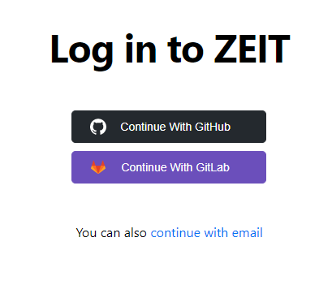
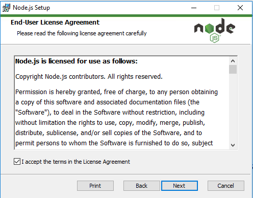
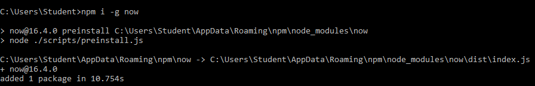
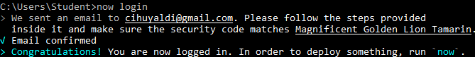
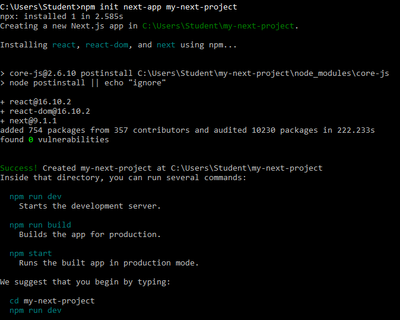
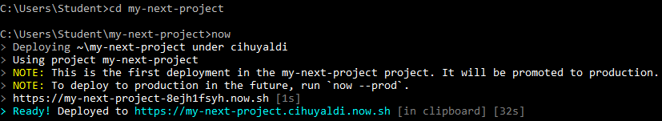
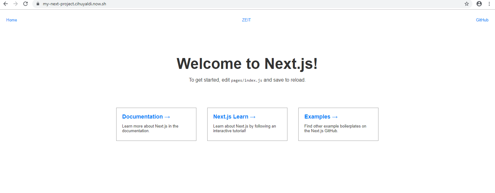

## Praktikum Teknologi Cloud

### Pertemuan 7

##### Laurentius Rezaldi Pradana Putra / 175410043

1. Pertama-tama anda perlu membuka Zeit terlebih dahulu dan silahkan Login menggunakan akun github anda.

2. Lalu silahkan melakukan instalasi node.js

3. Kemudian lakukan instalasi zeit

4. Lakukan login now

5. Buatlah project dengan perintah npm init

6. Pindah ke direktori project yang sudah kita buat dan lakukan Now

7. Silahkan akses link yang tercipta dan rasakan manfaatnya
