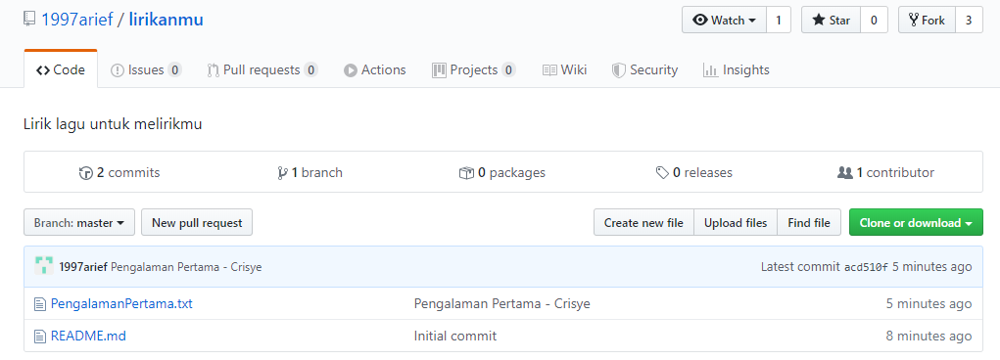
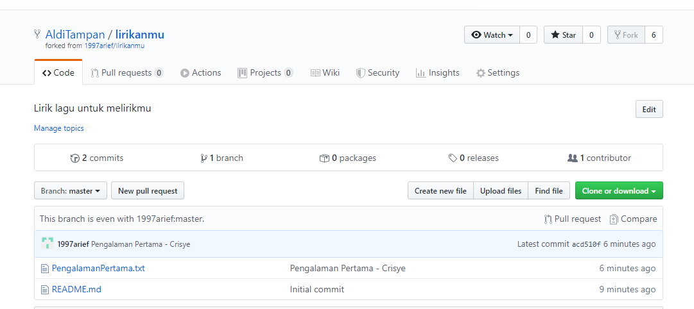
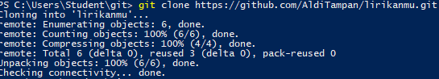
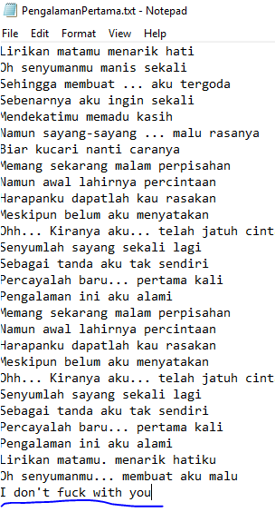
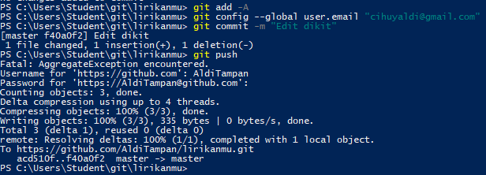
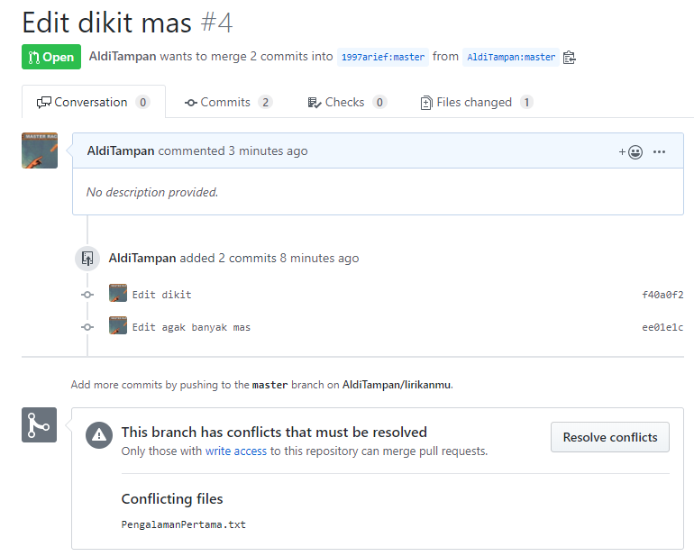

Laurentius Rezaldi Pradana Putra
175410043		
Pertemuan 10

1. Lakukan fork dari repo kepada repository target

2. Kemudian clone repository yang telah kita fork

3. Lalu edit beberapa file agar berubah dari versi aslinya

4. Setelah itu lakukan git push 

5. Setelah dicek ternyata sudah konflik
