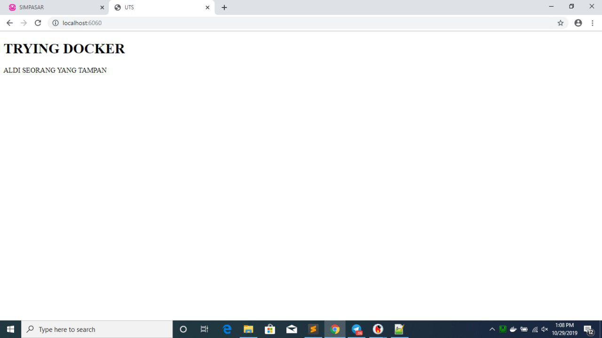
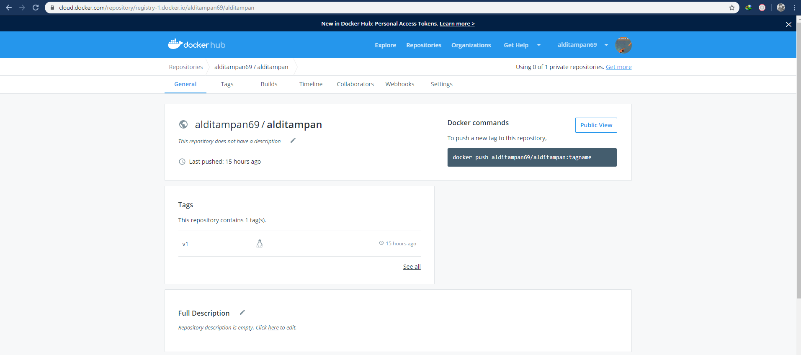

## Praktikum Teknologi Cloud

### UTS

##### Laurentius Rezaldi Pradana Putra / 175410043

1. Langkah yang perlu dilakukan adalah membuat folder baru dengan mkdir
<pre>
mkdir "nama direktori"
</pre> 
2. Lalu download aplikasi yang sudah anda pilih
<pre>
git clone "link aplikasi"
</pre> 
3. Silahkan buat Docker file pada direktori yang sudah anda buat

-- FROM nginx:alpine

-- COPY default.conf /usr/nginx/conf.d/default.conf

-- COPY ./2048 /usr/share/nginx/html

4. Membuat image dari Dockerfile yang sudah anda buat 

-- docker build -t alditampan69/alditampan:v1 .  

5. Membuat image dari Dockerfile  

-- docker build -t lukmansl1994/galery-luk:v1 .

6. Menjalankan image menjadi container  

-- docker run -d -p 6060:80  

--name=tcc alditampan69/alditampan:v1

7. Silahkan anda cek di browser anda
  

8. Silahkan login ke docker hub
-- docker login docker.io  
<pre>
PS C:\Users\User> docker login docker.io
Login with your Docker ID to push and pull images from Docker Hub. If you don't have a Docker ID, head over to https://hub.docker.com to create one.
Username: alditampan69
Password:
Login Succeeded
</pre>    

9. Kemudian upload image yang di buat tadi
 
--docker push alditampan69/alditampan:v1  

10. Sekarang dockerhub sudah bisa diakses
 
https://cloud.docker.com/repository/registry-1.docker.io/alditampan69/alditampan

